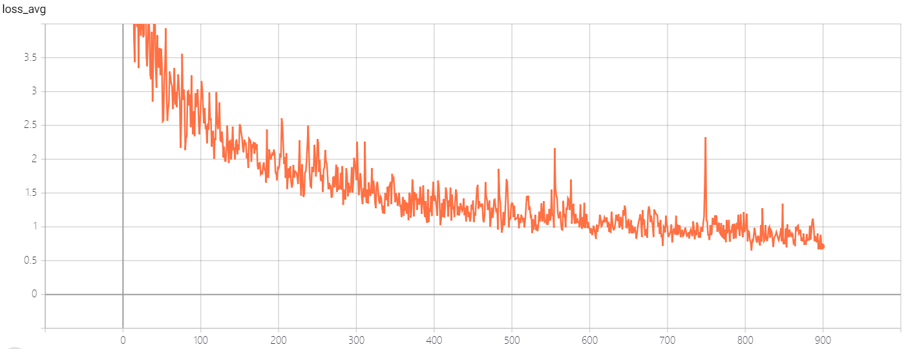
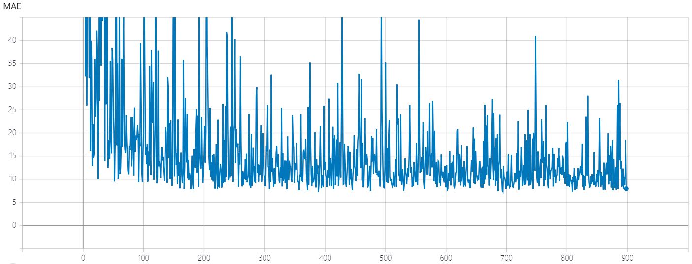
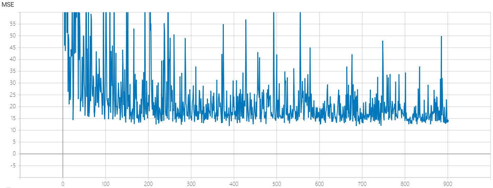

# ASD-crowd-counting

This is an unofficial implementation of the ICASSP 2019 paper [Adaptive Scenario Discovery for Crowd Counting](https://arxiv.org/abs/1812.02393) by PyTorch. Different with the paper, I added some data augmentation methods that turn out to be effective. 

## Prerequisites

Python: 3.5

PyTorch: 1.0.1

## Train

I have trained the model on ShanghaiTech part B. This is the training and testing logs on TensorBoard.

Average loss on training set

MAE on test set

MSE on test set
 

## Results

MAE: 7.28 MSE: 11.85 on ShanghaiTech part B. 

Download checkpoint: [Google Drive](https://drive.google.com/open?id=1X3HzIdx5O6aU7QawQSHsntblpiTplpwh)

